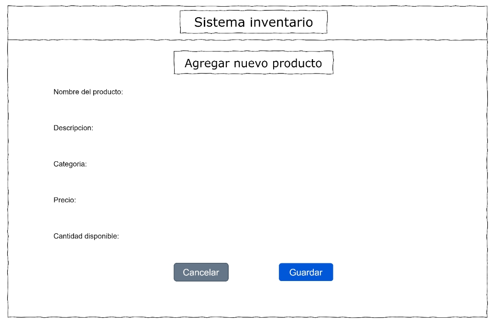
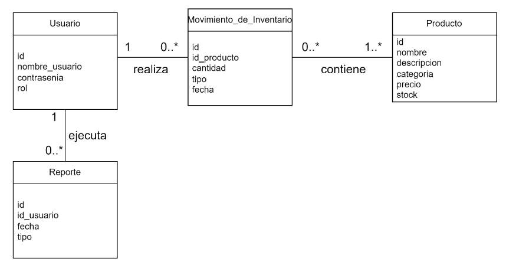

Ejercicio 8: Ejercicios sobre Metodologías de Desarrollo en Cascada

1. Análisis de requerimientos:
    Ejercicio 1: Un cliente te solicita una aplicación web para gestionar su inventario. Define los requisitos funcionales y no funcionales del sistema.
    - Requisitos Funcionales:
        Autenticación y Autorización:
            Los usuarios deben poder registrarse y autenticarse.
            Diferentes niveles de acceso (administrador, empleado).
        Gestión de Productos:
            Agregar un nuevo producto.
            Editar información de un producto existente.
            Eliminar un producto.
            Buscar y visualizar productos.
        Gestión de Inventario:
            Actualizar el stock de productos.
            Notificar cuando el stock de un producto esté bajo un umbral definido.
        Informes y Estadísticas:
            Generar informes de inventario.
            Visualizar estadísticas de ventas y stock.
    - Requisitos No Funcionales:
        Rendimiento:
            La aplicación debe ser capaz de manejar múltiples solicitudes simultáneas sin degradar el rendimiento.
        Seguridad:
            Los datos de los usuarios y productos deben ser protegidos mediante encriptación.
            La aplicación debe cumplir con las normativas de protección de datos.
        Escalabilidad:
            La arquitectura del sistema debe permitir la adición de nuevas funcionalidades sin grandes cambios.
        Usabilidad:
            La interfaz de usuario debe ser intuitiva y fácil de usar.
        Compatibilidad:
            La aplicación debe ser accesible desde los principales navegadores web.

    Ejercicio 2: Redacta un caso de uso para la funcionalidad de "Agregar un nuevo producto" en la aplicación web del ejercicio 1.
    - Caso de Uso
        
        

2. Diseño del sistema:
    Ejercicio 3: Elabora un diagrama de flujo de datos para la aplicación web del ejercicio 1.
    - Diagrama de flujo
        
        

    Ejercicio 4: Diseña la interfaz de usuario para la pantalla de "Inicio" de la aplicación web del ejercicio 1.
    - Interfaz de usuario

        

3. Diseño del Programa:
    Ejercicio 5: Elige una arquitectura adecuada para la aplicación web del ejercicio 1 y justifica tu elección.
    - Arquitectura:
        Arquitectura en Capas (Multicapa):
        Capa de Presentación: Interfaz de usuario accesible desde navegadores web.
        Capa de Negocio: Lógica de la aplicación, reglas de negocio y validación.
        Capa de Datos: Acceso y manipulación de la base de datos.
    
    Se ha elegido esta arquitectura por:
        - Separación de responsabilidades: Facilita el mantenimiento y la escalabilidad del sistema.
        - Reutilización de componentes: Las capas pueden ser desarrolladas y probadas de manera independiente.
        - Facilidad de pruebas: Cada capa puede ser probada de manera aislada, mejorando la calidad del software.
    
    Ejercicio 6: Diseña la base de datos para la aplicación web del ejercicio 1.
    - Para diseñar la base de datos de la aplicación web para gestionar el inventario, se ha optado por un modelo relacional. Este tipo de base de datos es ideal para aplicaciones donde la integridad de los datos, las relaciones entre diferentes entidades y la capacidad de realizar consultas complejas son cruciales. Las bases de datos relacionales, como MySQL, PostgreSQL, y otros, ofrecen robustez, escalabilidad y soporte para transacciones, lo que garantiza que las operaciones se ejecuten correctamente y que los datos se mantengan consistentes.

    Las tablas quedarian de la siguiente manera:
        Productos
        -id_producto (PK)
        -nombre
        -descripción
        -categoría
        -precio
        -stock

        Usuarios
        -id_usuario (PK)
        -nombre_usuario
        -contraseña
        -rol (administrador, empleado)

        Movimientos de Inventario
        -id_movimiento (PK)
        -id_producto (FK)
        -cantidad
        -tipo (entrada, salida)
        -fecha

        Reportes
        -id_reporte (PK)
        -id_usuario (FK)
        -fecha
        -tipo

4. Diseño:
    Utilizando los siguientes diagrama resuelva los casos de usos de los  ejercicios 7 y 8: 
    ---------------------------------------------------------------------------------------------------------                |
    |                                                                                                       |
    |    Diagrama de Dominio: Identifica las entidades, atributos y relaciones del sistema.                 |
    |    Diagrama de Robustez: Analiza cómo el sistema responde a diferentes escenarios de uso.             |
    |    Prototipo: Crea una versión simplificada del sistema para probar la usabilidad y funcionalidad.    |
    |    Diagrama de Secuencia: Describe la interacción entre los diferentes objetos del sistema.           |
    |    Diagrama de Clases: Define las clases, sus atributos, métodos y relaciones                         |
    |                                                                                                       |
    ---------------------------------------------------------------------------------------------------------
    
    Ejercicio 7: Implementa la funcionalidad de "Agregar un nuevo producto" en la aplicación web del ejercicio 1 utilizando el lenguaje de programación de tu preferencia.
    (Es Codificacion --> No se hace)

    Ejercicio 8: Implementa la lógica de negocio para la funcionalidad de "Agregar un nuevo producto" en la aplicación web del ejercicio 1.
    - Modelo de dominio

        

    - Diagrama de robustez

        
   
    - Diagrama de secuencia

        

    - Diagrama de clases

        